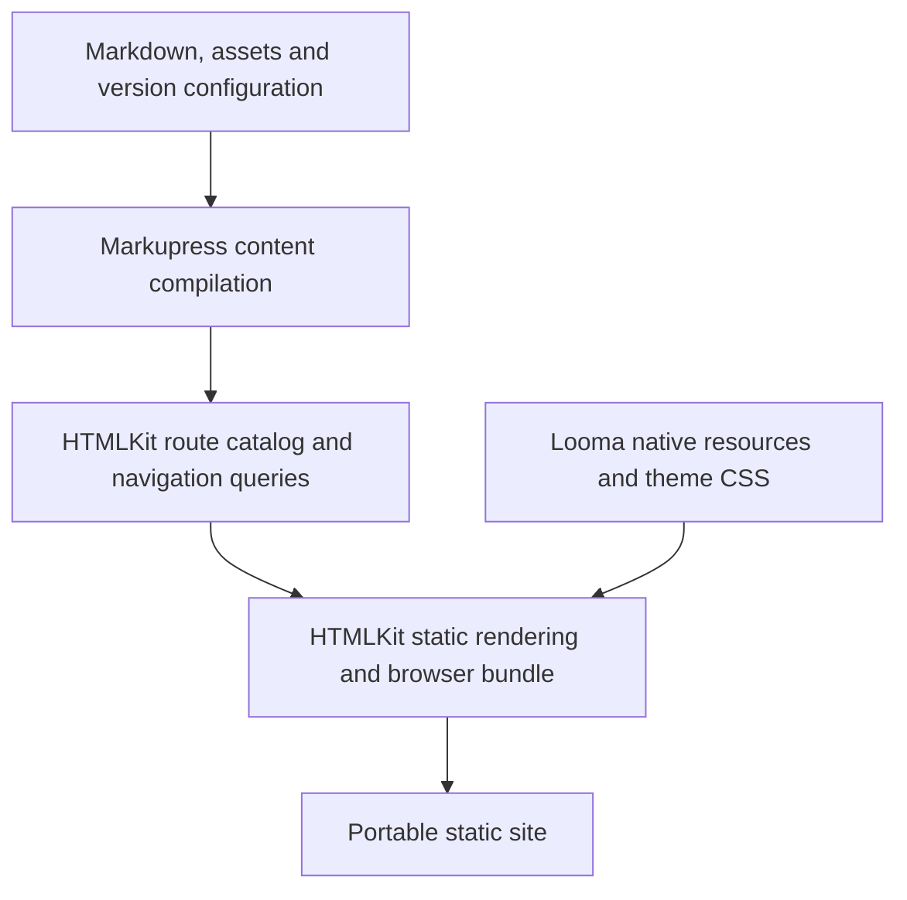
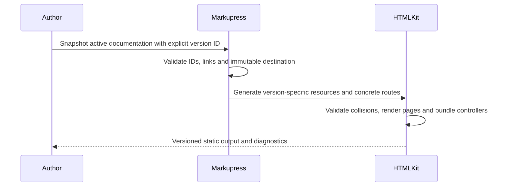
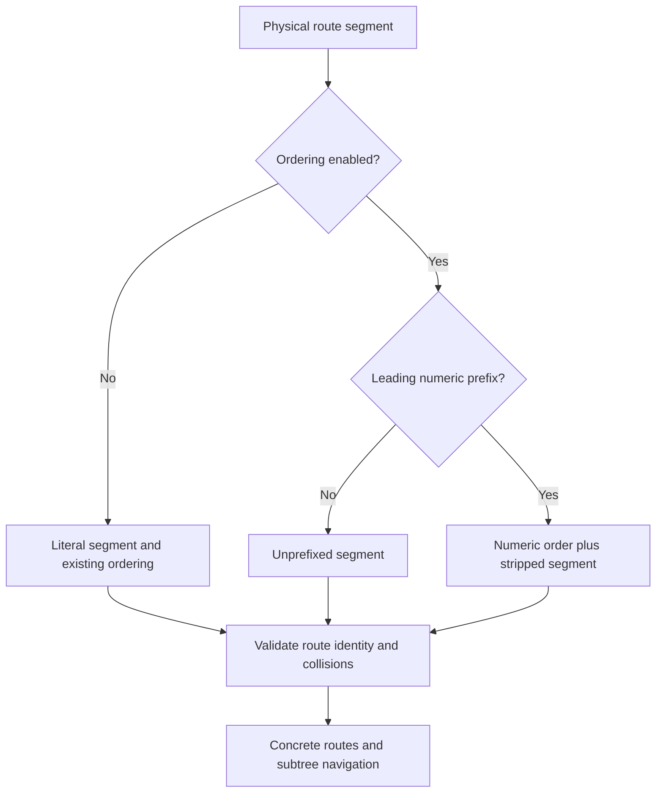

# Markupress Platform - Plan

## Goal Capsule

- **Objective:** Authors can publish versioned Markdown documentation with interactive declarative components and a coherent navigation experience.
- **Means:** Build Markupress on HTMLKit, using Looma for its default theme (R4, R7, R10).
- **Authority:** User requirements below; repository AGENTS.md; Foundation ownership manifest; linked public HTML Next proposal for declarative component semantics.
- **Execution:** Single agent, native model, no cross-model review. Create the repository and preserve the standards before implementing the platform features in dependency order.
- **Stop conditions:** A required consumer behavior fails without an understood correction, or an operation would overwrite unrelated work. Record the evidence and preserve changes.
- **Delivery:** Public MIT repository `threadlabs-studio/markupress`; npm package `markupress`. The existing 0.0.1 reservation has no implementation.

---

## Product Contract

### Summary

Markupress turns Markdown and native declarative components into a static documentation site. Versioning belongs to the documentation product; ordered routes and general navigation belong to HTMLKit.

### Problem Frame

HTMLKit already renders file-routed applications and includes a documentation proof, but that proof does not provide a reusable versioned documentation product. A separate repository gives documentation authors a maintained tool while exercising the platform through a real consumer.

### Key Decisions

- **Public, MIT.** Governs R1. (session-settled: user-directed — chosen over accepting starter defaults: the owner explicitly confirmed both.)
- **Unscoped npm package.** Governs R2. (session-settled: user-directed — chosen over an organization-scoped package: the owner requested reserving `markupress` itself.)
- **Static production first.** Governs R4. (session-settled: user-directed — chosen over delivering request-time rendering immediately: prove static delivery while retaining an SSR design.)
- **Component-owned metadata.** Governs R5. (session-settled: user-directed — chosen over file-level page metadata: a resource may define multiple components.)

### Requirements

**Repository and authoring**

- R1. Initialize `threadlabs-studio/markupress` as a public MIT repository using a reviewed Foundation plan and resolved dependency pins.
- R2. Keep the npm name `markupress`, use pnpm 12 through Corepack, and protect production publishing with the Foundation release workflow.
- R3. Use strict ESM TypeScript 7 for maintained controllers; authored HTML references emitted `.js` module names and the build resolves the corresponding TypeScript source.
- R4. Deliver a static build, development server, and preview through HTMLKit; retain its separate request-time rendering design.
- R5. Support Markdown with native declarative HTML components and resource dependency links; metadata belongs to the generated page component and literal code examples remain inert.

**Navigation and versions**

- R6. HTMLKit supports opt-in numeric ordering prefixes on route directories and files, stripping those prefixes from URLs and sorting navigation numerically.
- R7. HTMLKit supplies a reusable navigation component and route-navigation data; Markupress consumes both rather than duplicating them.
- R8. Markupress supports explicit documentation versions with frozen content snapshots, labels, a default version, and stable version-specific URLs.
- R9. Version selection preserves the current logical document when available and visibly falls back to that version's landing page when absent; links and navigation stay within the selected version.

**Theme and maintenance**

- R10. Use native Looma components in the default theme, with keyboard navigation, accessible landmarks, responsive layout, and light/dark styling.
- R11. Include canonical AGENTS.md, a CLAUDE.md import, Compound Engineering configuration and durable plans/learnings, Foundation freshness checks, package-consumer verification, and CI.
- R12. Preserve a migration path for existing Markdown documentation, code examples, assets, stable anchors, and route aliases, including future Jess/Less documentation migrations.

### Acceptance Examples

- AE1. Covers R3: A component references `controller="./counter.js"` while the maintained source is `counter.ts`; development and packed production builds execute its click handler and TypeScript checks reject an invalid controller type.
- AE2. Covers R6: `01-guide/02-installation.html` produces `/guide/installation/`; changing `02-` to `10-` moves its navigation position without changing that URL. `01-index.html` is the directory landing page after stripping.
- AE3. Covers R6: `01-guide.html` and `02-guide.html` fail with a collision diagnostic naming both sources; existing HTMLKit applications retain literal prefixes unless the option is enabled.
- AE4. Covers R5: A Markdown code fence containing `<template>`, `$each`, or `<link>` displays literal text. An authored component outside the fence renders and hydrates through HTMLKit. A dependency link loads only the named resource.
- AE5. Covers R8, R9: Switching `/v/2/guide/install/` to version 1 selects `/v/1/guide/install/` when its logical document exists, otherwise `/v/1/` with an explanation. Browser reload preserves version selection.
- AE6. Covers R10, R12: A site with HTML, CSS, Less, JavaScript, and TypeScript examples builds, exposes durable heading anchors, and serves assets correctly from a nested deployment base.

### Scope Boundaries

Actual migration of a documentation site is follow-up work. Establish its import compatibility and parity gate first; do not replace a live documentation deployment merely because the new site builds.

### Sources

- HTMLKit: `packages/htmlkit/src/routes.ts`, `application.ts`, `resource.ts`, `browser.ts`, and `examples/docs/proof.ts` in `nextwebwg/html-next`.
- [Foundation configuration and ownership](https://github.com/threadlabs-studio/foundation/blob/main/docs/configuration.md).
- [TypeScript 7 release](https://devblogs.microsoft.com/typescript/announcing-typescript-7-0/) and [module resolution](https://www.typescriptlang.org/docs/handbook/modules/reference.html).
- [Vite TypeScript support](https://vite.dev/guide/features.html#typescript).
- [Looma package and native resource exports](https://github.com/threadlabs-studio/looma/blob/main/packages/looma/package.json).
- [Docusaurus versioning](https://docusaurus.io/docs/versioning), as prior art rather than an adopted implementation.

---

## Planning Contract

### Key Technical Decisions

- KTD1. **Resolve controllers through Vite.** Characterize the existing `.js`-to-`.ts` resolution before adding code; Vite owns transpilation and the TypeScript CLI owns type checking (R3). TypeScript 7's lack of a stable compiler API must not become a Markdown integration dependency.
- KTD2. **Preserve physical route identity.** Add an opt-in HTMLKit route-ordering option; interpret a leading decimal number followed by `-` on each literal segment, but keep physical paths for loaders, imports, and diagnostics (R6). Compare numeric ranks before labels, put unprefixed entries after prefixed entries, and use a deterministic tie-breaker. Reject empty stripped segments and collisions. Dynamic parameter syntax is unchanged.
- KTD3. **Use ordinary navigation data and components.** Add a generic navigation query to the HTMLKit loader context and a style-independent native component resource (R7). A query selects a path subtree from the finalized concrete route catalog, returns ordered items, and excludes unresolved dynamic route patterns. Markupress supplies documentation labels and visibility policy.
- KTD4. **Compile Markdown into HTMLKit resources.** Parse Markdown tokens and preserve native HTML; emit a selected, uniquely named page component with its metadata inside the carrier (R5). Extract declared resource dependencies at the resource level without treating fenced examples as declarations. Resolve resources and assets relative to their original source. Do not implement a second component runtime.
- KTD5. **Keep document identity separate from paths and tags.** Store version ID, logical document ID, URL pathname, and generated component tag independently (R8, R9). Derive unique tags from version and logical identity, not ordering prefixes. Explicit version configuration determines version ordering; SemVer is not required.
- KTD6. **Import Looma resources selectively.** Use `@threadlabs/looma/components/*` and its CSS exports through native resource links (R10). Avoid the root module's automatic registration of a second runtime. Validate the installed Looma/HTMLKit combination before pinning it.

### Assumptions

These defaults fill gaps in the request and may be adjusted without changing its requirements: enable prefix stripping by default in Markupress but leave HTMLKit's default unchanged; put published versions under `/v/<id>/`; store immutable snapshots under `versioned_docs/<id>/`; keep active docs in `docs/`. Checked JSDoc remains a supported author choice, but maintained project controllers use TypeScript.

The navigation authoring shape is an ordinary dependency link plus a component supplied with loader data: link the proposed `@nextwebwg/htmlkit/components/navigation.html` resource, render `<htmlkit-navigation from:items="navigation">`, and declare the layout's `navigation` prop. The layout loader obtains that value with a subtree query. These are planned APIs, not existing exports; confirm prop declarations and native component semantics against the public proposal before implementing them.

Markdown dependency links name real native component resources. A controller link retains its `.js` spelling; no `.ts` module URL is emitted into production HTML. Markdown frontmatter may provide documentation fields such as title, description, and sidebar label, which compile into the owning page's metadata or Markupress navigation data.

### High-Level Technical Design

These sketches show boundaries rather than prescribe private implementation structures.

### Risks and Dependencies

Foundation currently resolves TypeScript 7.0.2, pnpm 12.9.1, Node 22/24 LTS, Vitest 5.0.0, and Oxlint 1.81.0. Apply its actual generated plan rather than copying these values into a handmade starter.

Looma's current manifest depends on an older HTML Next release. A packed native-resource consumer must demonstrate one compatible runtime and working controllers before the product depends on it. Request-time rendering stays an HTMLKit concern; Markupress's content catalog and version identity must not depend on static output filenames.

---

## Implementation Units

### U1. Repository contract and Foundation initialization

- **Goal:** Establish the public MIT development home and preserve R1, R2, R11.
- **Files:** Foundation-owned root files, `AGENTS.md`, `CLAUDE.md`, `.compound-engineering/config.yaml`, `docs/plans/`, and project README.
- **Approach:** Preview Foundation's TypeScript library bundle; inspect modules, ownership, costs, and exact digest; apply it. Preserve ownership of generated files, using an explicit reviewed local ownership change for product-specific edits. Keep cross-model review off. Create the public repository after verification, with no placeholder product API or automatic publish of 0.0.1.
- **Test expectation:** No product behavior tests for scaffolding; use Foundation audit, generated verification, and package-consumer gates.
- **Verification:** Foundation audit and the generated `verify:pr`; compare emitted package metadata with R1 and R2.

### U2. HTMLKit ordered routes and navigation

- **Goal:** Implement R6 and R7 in `nextwebwg/html-next` before Markupress duplicates them.
- **Files:** `packages/htmlkit/src/routes.ts`, `types.ts`, `application.ts`, new navigation data/component resources, package exports, tests, README.
- **Approach:** Extend the existing discovery catalog per KTD2 and KTD3. Use native templates, anchors, attributes, and existing rendering helpers; audit those mechanisms before adding a runtime layer. Keep private route details out of public serialization.
- **Test scenarios:** AE2 and AE3; prefixes on directories and index files; ranks 1, 2, 10; root/base-prefixed subtree queries; aliases; enumerated dynamic routes; deterministic output; keyboard-operable anchors and current-page indication; installed navigation resource import.
- **Verification:** Focused route/navigation tests, `pnpm verify:inner`, `pnpm verify:pr`, and packed HTMLKit consumer.

### U3. Markdown pipeline and TypeScript controller consumer

- **Goal:** Implement R3, R4, R5 using KTD1 and KTD4; depends on U1 and U2.
- **Files:** Markupress `src/content/`, `src/build/`, CLI, component/controller examples, package exports, tests, and authoring documentation.
- **Approach:** Establish AE1 in an installed HTMLKit consumer first. Compile Markdown with dependencies, metadata, original-source resource resolution, literal code fences, deterministic heading anchors, and collision diagnostics. Reuse HTMLKit build/dev/preview APIs.
- **Test scenarios:** AE1 and AE4; a helper component in the same resource; imported components and controller exports; a nested asset path; non-root base; build diagnostics with Markdown source locations; installed CLI build and preview.
- **Verification:** Focused Vitest cases, TypeScript CLI, package-consumer build; one browser runner with one worker for development and production controller behavior.

### U4. Documentation versions and navigation policy

- **Goal:** Implement R8, R9 and the import foundations in R12; depends on U3.
- **Files:** Markupress `src/versions/`, content catalog, snapshot command, navigation projection, link resolution, tests, and versioning docs.
- **Approach:** Snapshot active content with assets and relative imports; reject existing destinations instead of overwriting them. Generate concrete version routes per KTD5 and feed labels/visibility into HTMLKit navigation. Preserve explicit route aliases and heading IDs.
- **Test scenarios:** AE5 and AE6; non-SemVer IDs; duplicate IDs or URLs; absent target documents; links to explicit other versions; immutable snapshot reruns; ordered filenames independent of logical identity; copied asset and component dependency paths.
- **Verification:** Version/catalog/link tests, installed two-version consumer, static output inspection, keyboard version-switch browser test.

### U5. Looma theme and migration proof

- **Goal:** Implement R10 and demonstrate R12; depends on U4.
- **Files:** Markupress native theme resources, TypeScript controllers, project-owned CSS, example documentation, accessibility and package-consumer checks.
- **Approach:** Select Looma native components using KTD6; implement responsive navigation, version selection, headings, code presentation, and accessible theme controls. Keep imported content adapters separate from theme composition. Establish a representative generic migrated corpus before proposing a live site migration.
- **Test scenarios:** Native component server rendering and browser adoption; keyboard sidebar/version/theme controls; mobile and desktop views; dark/light persistence; headings and Less/HTML/TS examples; no duplicate runtime registration; nested-base asset delivery.
- **Verification:** Packed consumer, focused accessibility/browser checks with one worker, full generated repository gates. Any later live-site migration must add its own URL, behavior, visual, and rollback parity evidence.

---

## Verification Contract

- Apply Foundation preview only after its exact digest, ownership, modules, and verification cost are reviewed. Run a read-only audit after application and after local ownership changes.
- In HTML Next, use focused feature tests followed by `corepack pnpm verify:inner`; run `corepack pnpm verify:pr` before shipping platform changes.
- In Markupress, use the generated Foundation commands: focused tests during development, then `corepack pnpm verify:inner` and `corepack pnpm verify:pr` before delivery. Inspect generated release validation and installed-consumer checks before invoking them.
- Vite transpilation does not establish type correctness; run the TypeScript CLI separately (R3).
- Installed consumers must resolve public exports and raw component resources from a packed package, with no workspace-only imports.
- Run local Playwright commands in the foreground with `--workers=1`, one runner per repository. Record commands, results, skips, and remaining judgment.
- Production publishing is separate from the already-published reservation and follows the protected workflow; do not republish 0.0.1.

---

## Definition of Done

U1 is complete when the public MIT repository contains the reviewed Foundation baseline and canonical standards, and its required checks pass. U2 is complete when existing route behavior is preserved by default and installed consumers use ordered navigation. U3 is complete when Markdown components and TypeScript controllers work in development and packed production. U4 is complete when snapshots and version-aware navigation meet AE5. U5 is complete when the installed default theme passes its accessibility and resource compatibility checks.

The product is complete when all requirements have implementation and verification evidence, the public authoring documentation matches the actual APIs, and abandoned prototypes or unused APIs are removed. A passing scaffold or reservation package does not establish product completion.
